# 採用管理システム ビジネスプロセス・データフロー図

## 採用プロセス全体フロー

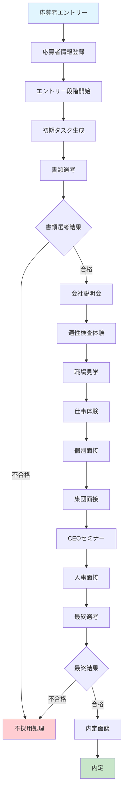

## 段階別タスク管理フロー

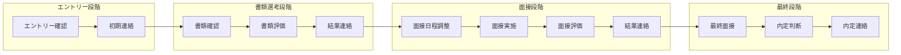

## タスク実行プロセス

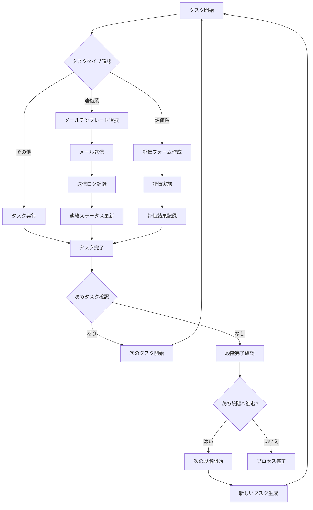

## イベント管理プロセス

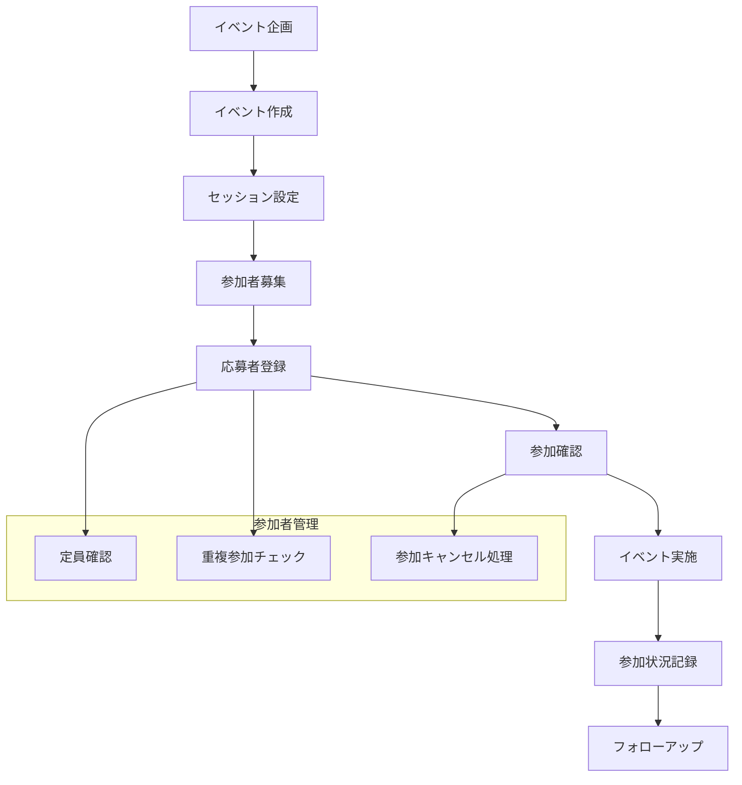

## データ連携フロー

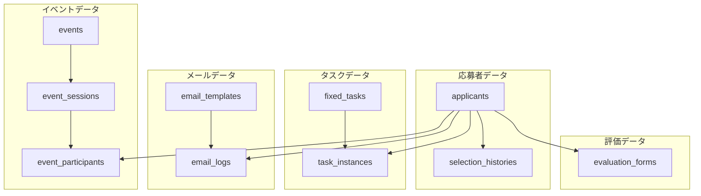

## ステータス遷移図

### 応募者ステータス遷移

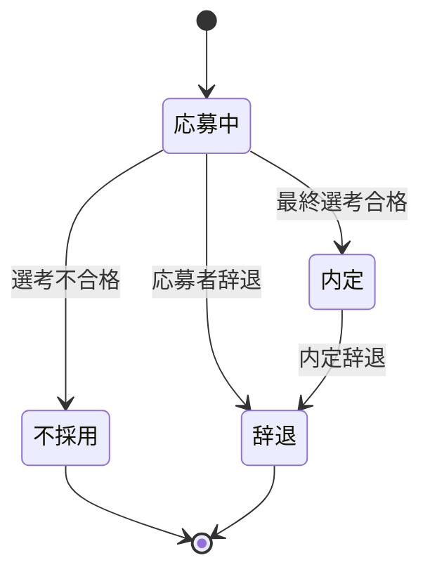

### タスクステータス遷移

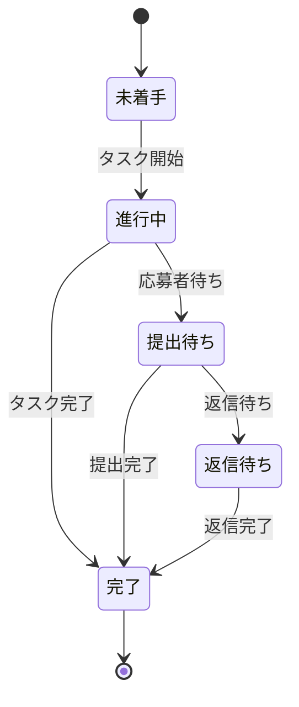

### 選考段階ステータス遷移

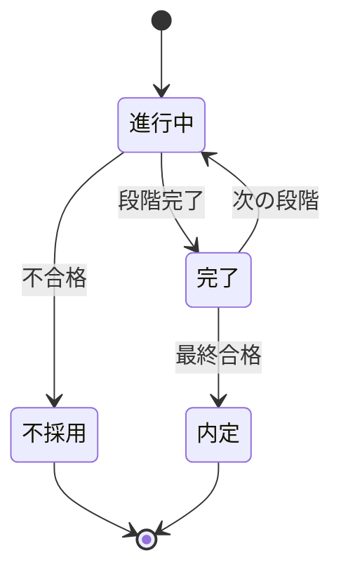

## データ更新タイミング

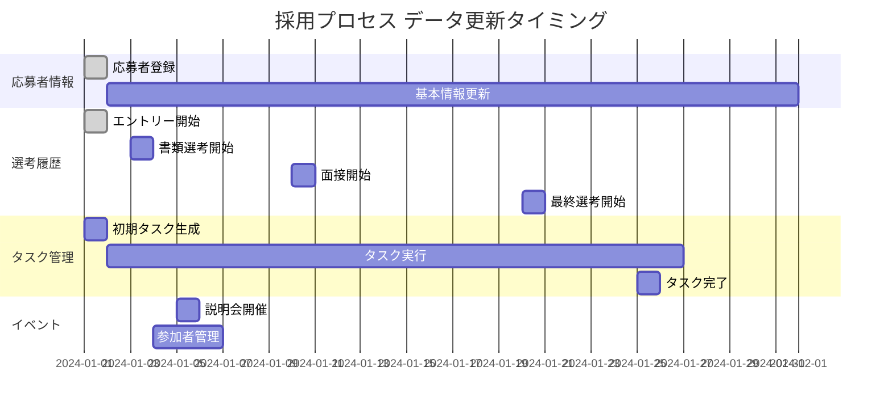

## システム連携図

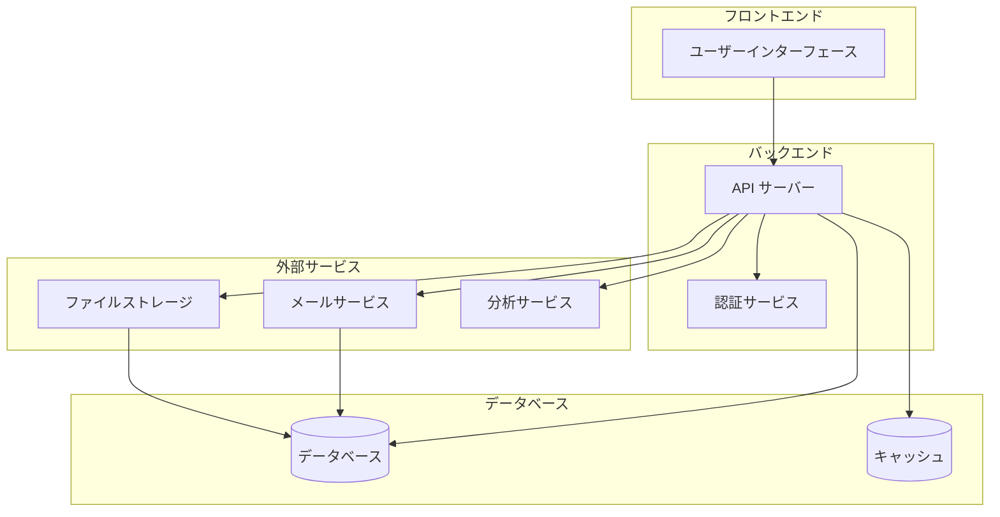

## エラーハンドリングフロー

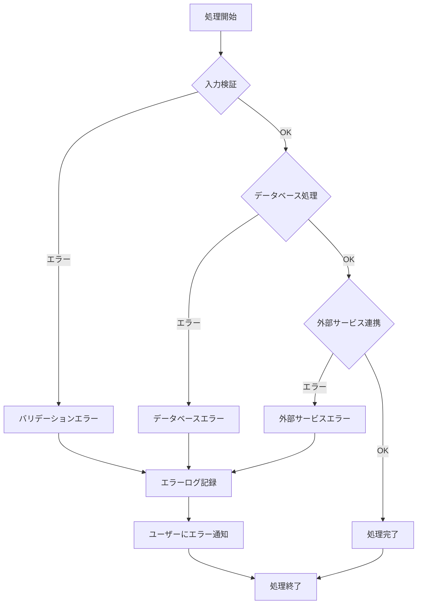

## 監査ログフロー

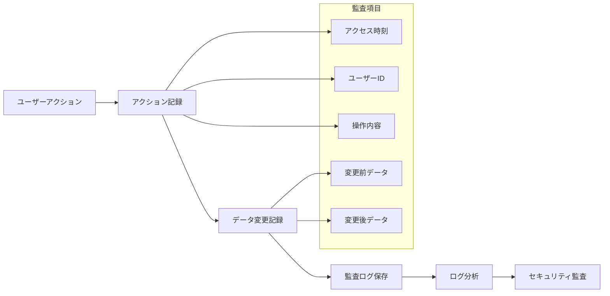

## パフォーマンス監視

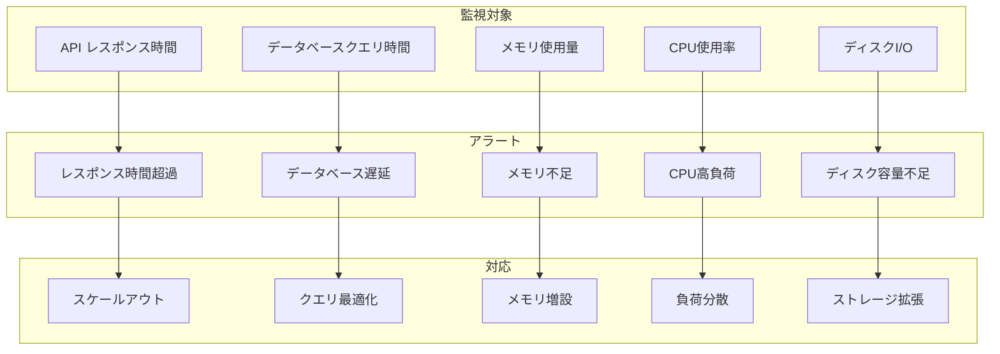

## バックアップ・復旧フロー

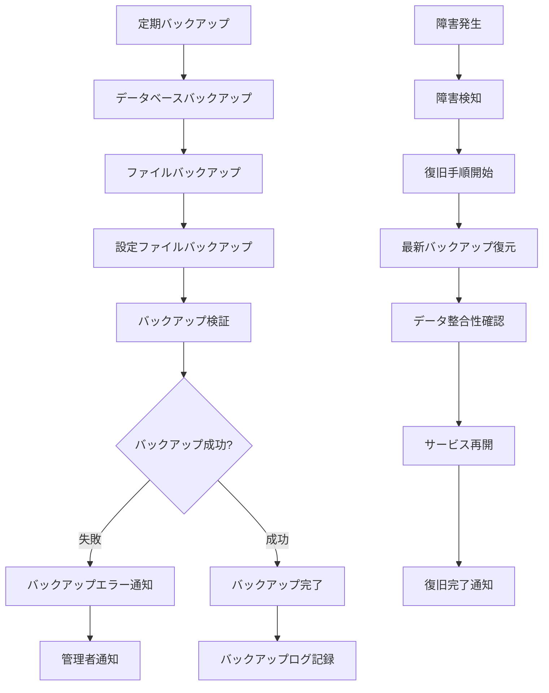

---

*このドキュメントは採用管理システムのビジネスプロセスとデータフローを視覚的に表現し、システムの動作とデータの流れを理解しやすくすることを目的としています。*
