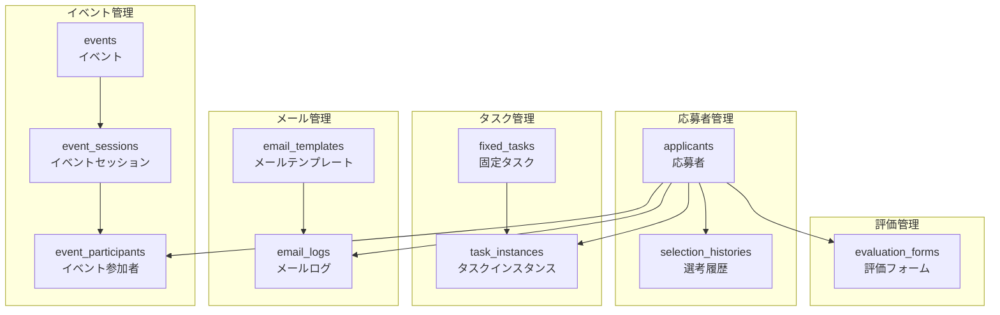

# 採用管理システム データベース構造図

## データベース全体構造



## テーブル詳細構造

### 1. 応募者テーブル（applicants）

```
┌─────────────────────────────────────────────────────────────┐
│                        applicants                          │
├─────────────────────────────────────────────────────────────┤
│ PK  id                    VARCHAR(36)    NOT NULL          │
│     name                  VARCHAR(100)   NOT NULL          │
│     name_kana             VARCHAR(100)   NOT NULL          │
│     email                 VARCHAR(255)   NOT NULL UNIQUE   │
│     phone                 VARCHAR(20)                      │
│     address               TEXT                             │
│     education             VARCHAR(100)   NOT NULL          │
│     graduation_year       VARCHAR(4)     NOT NULL          │
│     source                VARCHAR(50)    NOT NULL          │
│     gender                ENUM           NOT NULL          │
│     current_stage         ENUM           NOT NULL          │
│     status                ENUM           NOT NULL          │
│     notes                 TEXT                             │
│     created_at            TIMESTAMP      NOT NULL          │
│     updated_at            TIMESTAMP      NOT NULL          │
└─────────────────────────────────────────────────────────────┘
```

**インデックス:**
- `PRIMARY KEY (id)`
- `UNIQUE KEY (email)`
- `INDEX idx_current_stage (current_stage)`
- `INDEX idx_status (status)`

### 2. 選考履歴テーブル（selection_histories）

```
┌─────────────────────────────────────────────────────────────┐
│                   selection_histories                      │
├─────────────────────────────────────────────────────────────┤
│ PK  id                    VARCHAR(36)    NOT NULL          │
│ FK  applicant_id          VARCHAR(36)    NOT NULL          │
│     stage                 ENUM           NOT NULL          │
│     start_date            TIMESTAMP      NOT NULL          │
│     end_date              TIMESTAMP                        │
│     status                ENUM           NOT NULL          │
│     result                ENUM                             │
│     notes                 TEXT                             │
│     created_at            TIMESTAMP      NOT NULL          │
│     updated_at            TIMESTAMP      NOT NULL          │
└─────────────────────────────────────────────────────────────┘
```

**インデックス:**
- `PRIMARY KEY (id)`
- `INDEX idx_applicant_id (applicant_id)`
- `INDEX idx_stage (stage)`
- `INDEX idx_start_date (start_date)`

### 3. 固定タスクテーブル（fixed_tasks）

```
┌─────────────────────────────────────────────────────────────┐
│                      fixed_tasks                           │
├─────────────────────────────────────────────────────────────┤
│ PK  id                    VARCHAR(36)    NOT NULL          │
│     stage                 ENUM           NOT NULL          │
│     title                 VARCHAR(200)   NOT NULL          │
│     description           TEXT           NOT NULL          │
│     type                  ENUM           NOT NULL          │
│     is_required           BOOLEAN        NOT NULL          │
│     estimated_duration    INT            NOT NULL          │
│     order                 INT            NOT NULL          │
└─────────────────────────────────────────────────────────────┘
```

**インデックス:**
- `PRIMARY KEY (id)`
- `INDEX idx_stage (stage)`
- `INDEX idx_order (order)`

### 4. タスクインスタンステーブル（task_instances）

```
┌─────────────────────────────────────────────────────────────┐
│                    task_instances                          │
├─────────────────────────────────────────────────────────────┤
│ PK  id                    VARCHAR(36)    NOT NULL          │
│ FK  applicant_id          VARCHAR(36)    NOT NULL          │
│ FK  task_id               VARCHAR(36)    NOT NULL          │
│     status                ENUM           NOT NULL          │
│     contact_status        ENUM                             │
│     due_date              TIMESTAMP                        │
│     started_at            TIMESTAMP                        │
│     completed_at          TIMESTAMP                        │
│     notes                 TEXT                             │
│     created_at            TIMESTAMP      NOT NULL          │
│     updated_at            TIMESTAMP      NOT NULL          │
└─────────────────────────────────────────────────────────────┘
```

**インデックス:**
- `PRIMARY KEY (id)`
- `INDEX idx_applicant_id (applicant_id)`
- `INDEX idx_task_id (task_id)`
- `INDEX idx_status (status)`
- `INDEX idx_due_date (due_date)`

### 5. イベントテーブル（events）

```
┌─────────────────────────────────────────────────────────────┐
│                         events                             │
├─────────────────────────────────────────────────────────────┤
│ PK  id                    VARCHAR(36)    NOT NULL          │
│     title                 VARCHAR(200)   NOT NULL          │
│     description           TEXT           NOT NULL          │
│     type                  ENUM           NOT NULL          │
│     start_date            TIMESTAMP      NOT NULL          │
│     end_date              TIMESTAMP      NOT NULL          │
│     venue                 VARCHAR(200)   NOT NULL          │
│     max_participants      INT            NOT NULL          │
│     status                ENUM           NOT NULL          │
│     created_at            TIMESTAMP      NOT NULL          │
│     updated_at            TIMESTAMP      NOT NULL          │
└─────────────────────────────────────────────────────────────┘
```

**インデックス:**
- `PRIMARY KEY (id)`
- `INDEX idx_start_date (start_date)`
- `INDEX idx_status (status)`

### 6. イベントセッションテーブル（event_sessions）

```
┌─────────────────────────────────────────────────────────────┐
│                   event_sessions                           │
├─────────────────────────────────────────────────────────────┤
│ PK  id                    VARCHAR(36)    NOT NULL          │
│ FK  event_id              VARCHAR(36)    NOT NULL          │
│     title                 VARCHAR(200)   NOT NULL          │
│     description           TEXT           NOT NULL          │
│     start                 TIMESTAMP      NOT NULL          │
│     end                   TIMESTAMP      NOT NULL          │
│     venue                 VARCHAR(200)   NOT NULL          │
│     format                ENUM           NOT NULL          │
└─────────────────────────────────────────────────────────────┘
```

**インデックス:**
- `PRIMARY KEY (id)`
- `INDEX idx_event_id (event_id)`
- `INDEX idx_start (start)`

### 7. イベント参加者テーブル（event_participants）

```
┌─────────────────────────────────────────────────────────────┐
│                 event_participants                         │
├─────────────────────────────────────────────────────────────┤
│ PK  id                    VARCHAR(36)    NOT NULL          │
│ FK  session_id            VARCHAR(36)    NOT NULL          │
│ FK  applicant_id          VARCHAR(36)    NOT NULL          │
│     status                ENUM           NOT NULL          │
│     joined_at             TIMESTAMP                        │
│     created_at            TIMESTAMP      NOT NULL          │
│     updated_at            TIMESTAMP      NOT NULL          │
└─────────────────────────────────────────────────────────────┘
```

**インデックス:**
- `PRIMARY KEY (id)`
- `INDEX idx_session_id (session_id)`
- `INDEX idx_applicant_id (applicant_id)`
- `INDEX idx_status (status)`

### 8. メールテンプレートテーブル（email_templates）

```
┌─────────────────────────────────────────────────────────────┐
│                   email_templates                          │
├─────────────────────────────────────────────────────────────┤
│ PK  id                    VARCHAR(36)    NOT NULL          │
│     name                  VARCHAR(100)   NOT NULL          │
│     subject               VARCHAR(200)   NOT NULL          │
│     body                  TEXT           NOT NULL          │
│     stage                 ENUM           NOT NULL          │
│     type                  ENUM           NOT NULL          │
│     is_active             BOOLEAN        NOT NULL          │
│     created_at            TIMESTAMP      NOT NULL          │
│     updated_at            TIMESTAMP      NOT NULL          │
└─────────────────────────────────────────────────────────────┘
```

**インデックス:**
- `PRIMARY KEY (id)`
- `INDEX idx_stage (stage)`
- `INDEX idx_type (type)`
- `INDEX idx_is_active (is_active)`

### 9. メールログテーブル（email_logs）

```
┌─────────────────────────────────────────────────────────────┐
│                     email_logs                             │
├─────────────────────────────────────────────────────────────┤
│ PK  id                    VARCHAR(36)    NOT NULL          │
│ FK  template_id           VARCHAR(36)    NOT NULL          │
│ FK  applicant_id          VARCHAR(36)    NOT NULL          │
│     subject               VARCHAR(200)   NOT NULL          │
│     body                  TEXT           NOT NULL          │
│     status                ENUM           NOT NULL          │
│     sent_at               TIMESTAMP      NOT NULL          │
│     delivered_at          TIMESTAMP                        │
│     error_message         TEXT                             │
│     created_at            TIMESTAMP      NOT NULL          │
│     updated_at            TIMESTAMP      NOT NULL          │
└─────────────────────────────────────────────────────────────┘
```

**インデックス:**
- `PRIMARY KEY (id)`
- `INDEX idx_template_id (template_id)`
- `INDEX idx_applicant_id (applicant_id)`
- `INDEX idx_sent_at (sent_at)`
- `INDEX idx_status (status)`

### 10. 評価フォームテーブル（evaluation_forms）

```
┌─────────────────────────────────────────────────────────────┐
│                  evaluation_forms                          │
├─────────────────────────────────────────────────────────────┤
│ PK  id                    VARCHAR(36)    NOT NULL          │
│ FK  applicant_id          VARCHAR(36)    NOT NULL          │
│     stage                 ENUM           NOT NULL          │
│     evaluator_id          VARCHAR(36)    NOT NULL          │
│     evaluator_name        VARCHAR(100)   NOT NULL          │
│     evaluation_date       TIMESTAMP      NOT NULL          │
│     criteria              JSON           NOT NULL          │
│     overall_score         INT            NOT NULL          │
│     comments              TEXT           NOT NULL          │
│     result                ENUM           NOT NULL          │
│     created_at            TIMESTAMP      NOT NULL          │
│     updated_at            TIMESTAMP      NOT NULL          │
└─────────────────────────────────────────────────────────────┘
```

**インデックス:**
- `PRIMARY KEY (id)`
- `INDEX idx_applicant_id (applicant_id)`
- `INDEX idx_stage (stage)`
- `INDEX idx_evaluation_date (evaluation_date)`

## 列挙型（ENUM）定義

### SelectionStage（選考段階）
```sql
ENUM('エントリー', '書類選考', '会社説明会', '適性検査体験', 
     '職場見学', '仕事体験', '個別面接', '集団面接', 
     'CEOセミナー', '人事面接', '最終選考', '内定面談', '不採用')
```

### TaskType（タスクタイプ）
```sql
ENUM('アプローチ1', 'アプローチ1の実施', '詳細連絡', 
     '日程調整連絡', '提出書類', '結果連絡', 'リマインド')
```

### TaskStatus（タスクステータス）
```sql
ENUM('未着手', '完了', '提出待ち', '返信待ち')
```

### ContactStatus（連絡ステータス）
```sql
ENUM('未', '済', '返信待ち', '○')
```

### ParticipationStatus（参加ステータス）
```sql
ENUM('参加', '不参加', '未定', '申込', '欠席')
```

## 外部キー制約

```sql
-- 選考履歴 → 応募者
ALTER TABLE selection_histories 
ADD CONSTRAINT fk_selection_histories_applicant 
FOREIGN KEY (applicant_id) REFERENCES applicants(id) 
ON DELETE CASCADE;

-- タスクインスタンス → 応募者
ALTER TABLE task_instances 
ADD CONSTRAINT fk_task_instances_applicant 
FOREIGN KEY (applicant_id) REFERENCES applicants(id) 
ON DELETE CASCADE;

-- タスクインスタンス → 固定タスク
ALTER TABLE task_instances 
ADD CONSTRAINT fk_task_instances_task 
FOREIGN KEY (task_id) REFERENCES fixed_tasks(id) 
ON DELETE CASCADE;

-- イベントセッション → イベント
ALTER TABLE event_sessions 
ADD CONSTRAINT fk_event_sessions_event 
FOREIGN KEY (event_id) REFERENCES events(id) 
ON DELETE CASCADE;

-- イベント参加者 → セッション
ALTER TABLE event_participants 
ADD CONSTRAINT fk_event_participants_session 
FOREIGN KEY (session_id) REFERENCES event_sessions(id) 
ON DELETE CASCADE;

-- イベント参加者 → 応募者
ALTER TABLE event_participants 
ADD CONSTRAINT fk_event_participants_applicant 
FOREIGN KEY (applicant_id) REFERENCES applicants(id) 
ON DELETE CASCADE;

-- メールログ → テンプレート
ALTER TABLE email_logs 
ADD CONSTRAINT fk_email_logs_template 
FOREIGN KEY (template_id) REFERENCES email_templates(id) 
ON DELETE CASCADE;

-- メールログ → 応募者
ALTER TABLE email_logs 
ADD CONSTRAINT fk_email_logs_applicant 
FOREIGN KEY (applicant_id) REFERENCES applicants(id) 
ON DELETE CASCADE;

-- 評価フォーム → 応募者
ALTER TABLE evaluation_forms 
ADD CONSTRAINT fk_evaluation_forms_applicant 
FOREIGN KEY (applicant_id) REFERENCES applicants(id) 
ON DELETE CASCADE;
```

## データサンプル

### 応募者データ例
```sql
INSERT INTO applicants VALUES (
  'app-001',
  '田中太郎',
  'タナカタロウ',
  'tanaka@example.com',
  '090-1234-5678',
  '東京都渋谷区...',
  '東京大学工学部',
  '2024',
  'マイナビ',
  '男性',
  '書類選考',
  '応募中',
  '優秀な学生',
  NOW(),
  NOW()
);
```

### 固定タスクデータ例
```sql
INSERT INTO fixed_tasks VALUES (
  'task-001',
  '書類選考',
  '書類確認',
  '応募書類の内容を確認する',
  '提出書類',
  true,
  30,
  1
);
```

### タスクインスタンスデータ例
```sql
INSERT INTO task_instances VALUES (
  'instance-001',
  'app-001',
  'task-001',
  '未着手',
  NULL,
  '2024-01-15 17:00:00',
  NULL,
  NULL,
  NULL,
  NOW(),
  NOW()
);
```

## パフォーマンス最適化

### 推奨インデックス戦略
1. **検索頻度の高いカラム**: `email`, `current_stage`, `status`
2. **結合条件**: `applicant_id`, `task_id`, `session_id`
3. **日付範囲検索**: `start_date`, `due_date`, `sent_at`
4. **複合インデックス**: `(applicant_id, status)`, `(stage, order)`

### パーティショニング戦略
- **日付ベース**: `email_logs`, `selection_histories`
- **段階ベース**: `task_instances`
- **応募者ベース**: `evaluation_forms`

---

*このドキュメントは採用管理システムのデータベース構造を詳細に説明し、開発・運用チームがデータベース設計を理解し、適切なクエリを書くための参考資料として作成されています。*
