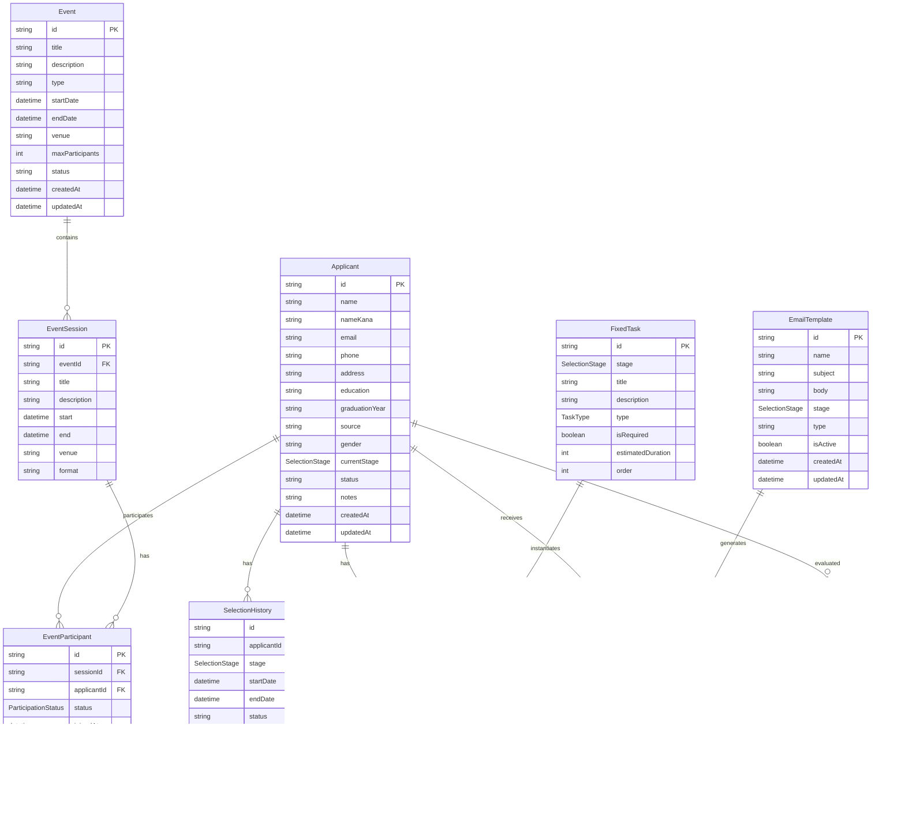

# 採用管理システム ER図・テーブル構造図

## ER図（Entity Relationship Diagram）



## テーブル構造図

### 1. 応募者管理テーブル

| テーブル名 | カラム名 | データ型 | 制約 | 説明 |
|-----------|---------|---------|------|------|
| **applicants** | id | string | PK | 応募者ID |
| | name | string | NOT NULL | 氏名 |
| | name_kana | string | NOT NULL | フリガナ |
| | email | string | UNIQUE, NOT NULL | メールアドレス |
| | phone | string | | 電話番号 |
| | address | string | | 住所 |
| | education | string | NOT NULL | 学歴 |
| | graduation_year | string | NOT NULL | 卒業予定年 |
| | source | string | NOT NULL | 応募元 |
| | gender | enum | NOT NULL | 性別 |
| | current_stage | enum | NOT NULL | 現在の選考段階 |
| | status | enum | NOT NULL | 応募状況 |
| | notes | text | | 備考 |
| | created_at | datetime | NOT NULL | 作成日時 |
| | updated_at | datetime | NOT NULL | 更新日時 |

### 2. 選考履歴テーブル

| テーブル名 | カラム名 | データ型 | 制約 | 説明 |
|-----------|---------|---------|------|------|
| **selection_histories** | id | string | PK | 履歴ID |
| | applicant_id | string | FK | 応募者ID |
| | stage | enum | NOT NULL | 選考段階 |
| | start_date | datetime | NOT NULL | 開始日 |
| | end_date | datetime | | 終了日 |
| | status | enum | NOT NULL | ステータス |
| | result | enum | | 結果 |
| | notes | text | | 備考 |
| | created_at | datetime | NOT NULL | 作成日時 |
| | updated_at | datetime | NOT NULL | 更新日時 |

### 3. タスク管理テーブル

| テーブル名 | カラム名 | データ型 | 制約 | 説明 |
|-----------|---------|---------|------|------|
| **fixed_tasks** | id | string | PK | タスクID |
| | stage | enum | NOT NULL | 対象選考段階 |
| | title | string | NOT NULL | タスク名 |
| | description | text | NOT NULL | タスク説明 |
| | type | enum | NOT NULL | タスクタイプ |
| | is_required | boolean | NOT NULL | 必須タスク |
| | estimated_duration | int | NOT NULL | 推定時間（分） |
| | order | int | NOT NULL | 段階内順序 |

| テーブル名 | カラム名 | データ型 | 制約 | 説明 |
|-----------|---------|---------|------|------|
| **task_instances** | id | string | PK | インスタンスID |
| | applicant_id | string | FK | 応募者ID |
| | task_id | string | FK | 固定タスクID |
| | status | enum | NOT NULL | タスクステータス |
| | contact_status | enum | | 連絡ステータス |
| | due_date | datetime | | 期限 |
| | started_at | datetime | | 開始日時 |
| | completed_at | datetime | | 完了日時 |
| | notes | text | | メモ |
| | created_at | datetime | NOT NULL | 作成日時 |
| | updated_at | datetime | NOT NULL | 更新日時 |

### 4. イベント管理テーブル

| テーブル名 | カラム名 | データ型 | 制約 | 説明 |
|-----------|---------|---------|------|------|
| **events** | id | string | PK | イベントID |
| | title | string | NOT NULL | イベント名 |
| | description | text | NOT NULL | イベント説明 |
| | type | enum | NOT NULL | イベントタイプ |
| | start_date | datetime | NOT NULL | 開始日 |
| | end_date | datetime | NOT NULL | 終了日 |
| | venue | string | NOT NULL | 開催場所 |
| | max_participants | int | NOT NULL | 最大参加者数 |
| | status | enum | NOT NULL | ステータス |
| | created_at | datetime | NOT NULL | 作成日時 |
| | updated_at | datetime | NOT NULL | 更新日時 |

| テーブル名 | カラム名 | データ型 | 制約 | 説明 |
|-----------|---------|---------|------|------|
| **event_sessions** | id | string | PK | セッションID |
| | event_id | string | FK | イベントID |
| | title | string | NOT NULL | セッション名 |
| | description | text | NOT NULL | セッション説明 |
| | start | datetime | NOT NULL | 開始時刻 |
| | end | datetime | NOT NULL | 終了時刻 |
| | venue | string | NOT NULL | 開催場所 |
| | format | enum | NOT NULL | 開催形式 |

| テーブル名 | カラム名 | データ型 | 制約 | 説明 |
|-----------|---------|---------|------|------|
| **event_participants** | id | string | PK | 参加者ID |
| | session_id | string | FK | セッションID |
| | applicant_id | string | FK | 応募者ID |
| | status | enum | NOT NULL | 参加ステータス |
| | joined_at | datetime | | 参加日時 |
| | created_at | datetime | NOT NULL | 作成日時 |
| | updated_at | datetime | NOT NULL | 更新日時 |

### 5. メール管理テーブル

| テーブル名 | カラム名 | データ型 | 制約 | 説明 |
|-----------|---------|---------|------|------|
| **email_templates** | id | string | PK | テンプレートID |
| | name | string | NOT NULL | テンプレート名 |
| | subject | string | NOT NULL | 件名 |
| | body | text | NOT NULL | 本文 |
| | stage | enum | NOT NULL | 対象選考段階 |
| | type | enum | NOT NULL | メールタイプ |
| | is_active | boolean | NOT NULL | 有効/無効 |
| | created_at | datetime | NOT NULL | 作成日時 |
| | updated_at | datetime | NOT NULL | 更新日時 |

| テーブル名 | カラム名 | データ型 | 制約 | 説明 |
|-----------|---------|---------|------|------|
| **email_logs** | id | string | PK | ログID |
| | template_id | string | FK | テンプレートID |
| | applicant_id | string | FK | 応募者ID |
| | subject | string | NOT NULL | 件名 |
| | body | text | NOT NULL | 本文 |
| | status | enum | NOT NULL | 送信ステータス |
| | sent_at | datetime | NOT NULL | 送信日時 |
| | delivered_at | datetime | | 配信日時 |
| | error_message | text | | エラーメッセージ |
| | created_at | datetime | NOT NULL | 作成日時 |
| | updated_at | datetime | NOT NULL | 更新日時 |

### 6. 評価管理テーブル

| テーブル名 | カラム名 | データ型 | 制約 | 説明 |
|-----------|---------|---------|------|------|
| **evaluation_forms** | id | string | PK | 評価ID |
| | applicant_id | string | FK | 応募者ID |
| | stage | enum | NOT NULL | 選考段階 |
| | evaluator_id | string | NOT NULL | 評価者ID |
| | evaluator_name | string | NOT NULL | 評価者名 |
| | evaluation_date | datetime | NOT NULL | 評価日 |
| | criteria | json | NOT NULL | 評価項目 |
| | overall_score | int | NOT NULL | 総合評価 |
| | comments | text | NOT NULL | コメント |
| | result | enum | NOT NULL | 結果 |
| | created_at | datetime | NOT NULL | 作成日時 |
| | updated_at | datetime | NOT NULL | 更新日時 |

## 列挙型（Enum）定義

### SelectionStage（選考段階）
```typescript
enum SelectionStage {
  ENTRY = 'エントリー',
  DOCUMENT_SCREENING = '書類選考',
  COMPANY_INFO = '会社説明会',
  APTITUDE_TEST = '適性検査体験',
  WORKPLACE_VISIT = '職場見学',
  JOB_EXPERIENCE = '仕事体験',
  INDIVIDUAL_INTERVIEW = '個別面接',
  GROUP_INTERVIEW = '集団面接',
  CEO_SEMINAR = 'CEOセミナー',
  HR_INTERVIEW = '人事面接',
  FINAL_SELECTION = '最終選考',
  OFFER_INTERVIEW = '内定面談',
  REJECTED = '不採用'
}
```

### TaskType（タスクタイプ）
```typescript
enum TaskType {
  APPROACH_1 = 'アプローチ1',
  APPROACH_1_EXECUTION = 'アプローチ1の実施',
  DETAILED_CONTACT = '詳細連絡',
  SCHEDULE_ADJUSTMENT = '日程調整連絡',
  DOCUMENT_SUBMISSION = '提出書類',
  RESULT_NOTIFICATION = '結果連絡',
  REMINDER = 'リマインド'
}
```

### TaskStatus（タスクステータス）
```typescript
enum TaskStatus {
  NOT_STARTED = '未着手',
  COMPLETED = '完了',
  PENDING_SUBMISSION = '提出待ち',
  PENDING_REPLY = '返信待ち'
}
```

### ContactStatus（連絡ステータス）
```typescript
enum ContactStatus {
  NOT_CONTACTED = '未',
  CONTACTED = '済',
  PENDING_REPLY = '返信待ち',
  CONFIRMED = '○'
}
```

## インデックス設計

### 主要インデックス
```sql
-- 応募者テーブル
CREATE INDEX idx_applicants_email ON applicants(email);
CREATE INDEX idx_applicants_current_stage ON applicants(current_stage);
CREATE INDEX idx_applicants_status ON applicants(status);

-- 選考履歴テーブル
CREATE INDEX idx_selection_histories_applicant_id ON selection_histories(applicant_id);
CREATE INDEX idx_selection_histories_stage ON selection_histories(stage);
CREATE INDEX idx_selection_histories_start_date ON selection_histories(start_date);

-- タスクインスタンステーブル
CREATE INDEX idx_task_instances_applicant_id ON task_instances(applicant_id);
CREATE INDEX idx_task_instances_task_id ON task_instances(task_id);
CREATE INDEX idx_task_instances_status ON task_instances(status);
CREATE INDEX idx_task_instances_due_date ON task_instances(due_date);

-- 固定タスクテーブル
CREATE INDEX idx_fixed_tasks_stage ON fixed_tasks(stage);
CREATE INDEX idx_fixed_tasks_order ON fixed_tasks(order);

-- イベント参加者テーブル
CREATE INDEX idx_event_participants_session_id ON event_participants(session_id);
CREATE INDEX idx_event_participants_applicant_id ON event_participants(applicant_id);
CREATE INDEX idx_event_participants_status ON event_participants(status);

-- メールログテーブル
CREATE INDEX idx_email_logs_applicant_id ON email_logs(applicant_id);
CREATE INDEX idx_email_logs_sent_at ON email_logs(sent_at);
CREATE INDEX idx_email_logs_status ON email_logs(status);

-- 評価フォームテーブル
CREATE INDEX idx_evaluation_forms_applicant_id ON evaluation_forms(applicant_id);
CREATE INDEX idx_evaluation_forms_stage ON evaluation_forms(stage);
CREATE INDEX idx_evaluation_forms_evaluation_date ON evaluation_forms(evaluation_date);
```

## データフロー図


## データ整合性制約

### 外部キー制約
```sql
-- 選考履歴 → 応募者
ALTER TABLE selection_histories 
ADD CONSTRAINT fk_selection_histories_applicant 
FOREIGN KEY (applicant_id) REFERENCES applicants(id);

-- タスクインスタンス → 応募者
ALTER TABLE task_instances 
ADD CONSTRAINT fk_task_instances_applicant 
FOREIGN KEY (applicant_id) REFERENCES applicants(id);

-- タスクインスタンス → 固定タスク
ALTER TABLE task_instances 
ADD CONSTRAINT fk_task_instances_task 
FOREIGN KEY (task_id) REFERENCES fixed_tasks(id);

-- イベントセッション → イベント
ALTER TABLE event_sessions 
ADD CONSTRAINT fk_event_sessions_event 
FOREIGN KEY (event_id) REFERENCES events(id);

-- イベント参加者 → セッション
ALTER TABLE event_participants 
ADD CONSTRAINT fk_event_participants_session 
FOREIGN KEY (session_id) REFERENCES event_sessions(id);

-- イベント参加者 → 応募者
ALTER TABLE event_participants 
ADD CONSTRAINT fk_event_participants_applicant 
FOREIGN KEY (applicant_id) REFERENCES applicants(id);

-- メールログ → テンプレート
ALTER TABLE email_logs 
ADD CONSTRAINT fk_email_logs_template 
FOREIGN KEY (template_id) REFERENCES email_templates(id);

-- メールログ → 応募者
ALTER TABLE email_logs 
ADD CONSTRAINT fk_email_logs_applicant 
FOREIGN KEY (applicant_id) REFERENCES applicants(id);

-- 評価フォーム → 応募者
ALTER TABLE evaluation_forms 
ADD CONSTRAINT fk_evaluation_forms_applicant 
FOREIGN KEY (applicant_id) REFERENCES applicants(id);
```

### チェック制約
```sql
-- 応募者ステータス
ALTER TABLE applicants 
ADD CONSTRAINT chk_applicant_status 
CHECK (status IN ('応募中', '内定', '不採用', '辞退'));

-- 選考履歴ステータス
ALTER TABLE selection_histories 
ADD CONSTRAINT chk_selection_history_status 
CHECK (status IN ('進行中', '完了', '不採用'));

-- タスクステータス
ALTER TABLE task_instances 
ADD CONSTRAINT chk_task_status 
CHECK (status IN ('未着手', '完了', '提出待ち', '返信待ち'));

-- 評価スコア
ALTER TABLE evaluation_forms 
ADD CONSTRAINT chk_overall_score 
CHECK (overall_score >= 1 AND overall_score <= 5);
```

---

*このドキュメントは採用管理システムのデータベース設計を視覚的に表現し、開発チームがデータ構造を理解しやすくすることを目的としています。*
